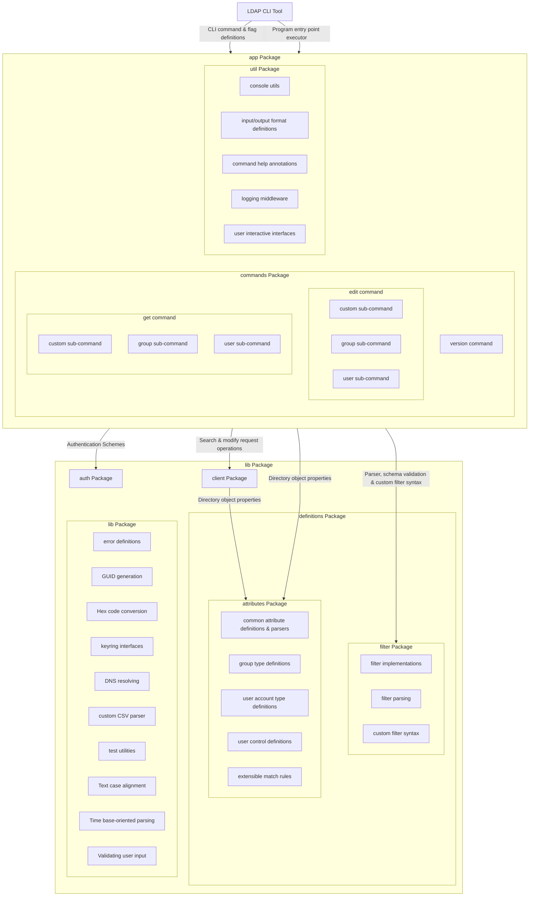

[](https://github.com/sarumaj/ldap-cli/actions/workflows/test_and_report.yml)
[](https://github.com/sarumaj/ldap-cli/actions/workflows/build_and_release.yml)
[](https://goreportcard.com/report/github.com/sarumaj/ldap-cli)
[](https://codeclimate.com/github/sarumaj/ldap-cli/maintainability)
[](https://codeclimate.com/github/sarumaj/ldap-cli/test_coverage)
[](https://pkg.go.dev/github.com/sarumaj/ldap-cli/v2)

---

# ldap-cli

**ldap-cli** is a cross-platform compatible LDAP-based command-line interface allowing ETL operations on Directory objects using LDAP Data Interchange Format (LDIF).

The CLI application is written in Go and uses the Cobra framework.
It is mainly intended for administrators and developers who want to query and edit directory objects.
It is highly adopted to work with Microsoft Active Directory, although openldap implementations are being used for testing.

Developed as Computer Science Project for IU ([www.iu-fernstudium.de](https://iu-fernstudium.de)).

## Installation

Download executable binary from the [release section](https://github.com/sarumaj/ldap-cli/releases/latest), e.g.:

```console
$ latest=$(curl -fsSI https://github.com/sarumaj/ldap-cli/releases/latest | grep -i location | sed 's/\r$//' | awk -F/ '{print $NF}') && \
  curl -fsSL "https://github.com/sarumaj/ldap-cli/releases/download/${latest}/ldap-cli_${latest}_linux-amd64" -o /usr/local/bin/ldap-cli
$ chmod +x /usr/local/bin/ldap-cli
```

Alternatively, build from source code (requires go 1.21.x runtime):

```console
$ git clone https://github.com/sarumaj/ldap-cli
$ cd ldap-cli
$ go build \
    -trimpath \
    -ldflags="-s -w -X 'main.Version=$(git describe --tags $(git rev-list --tags --max-count=1))' -X 'main.BuildDate=$(date -u "+%Y-%m-%d %H:%M:%S UTC")' -extldflags=-static" \
    -tags="osusergo netgo static_build" \
    -o /usr/local/bin/ldap-cli \
    "cmd/ldap-cli/main.go"
$ chmod +x /usr/local/bin/ldap-cli
```

## Features

- [x] LDAP/LDAPS authentication
  - [x] SIMPLE BIND
  - [x] NTLM (**not tested**)
  - [x] UNAUTHENTICATED
  - [x] MD5 (**not tested**)
  - [x] Preserve credentials in a keyring
- [x] Search directory objects
  - [x] Track progress of search operations
  - [x] Search users with options (user-id, enabled, expired, memberOf)
  - [x] Search groups with options (group-id)
  - [x] Search by providing custom LDAP filter
    - [x] Parse and validate filter syntax
    - [x] Register lexical aliases
- [x] Edit directory objects
  - [x] Edit group members
    - [x] Support arbitrary membership attribute
    - [x] LDIF edit mode
  - [x] Edit user's password
    - [x] Support arbitrary password attribute
    - [ ] Option to pass old password (**not available in LDIF mode**)
    - [x] LDIF edit mode
  - [x] Edit custom objects
    - [x] LDIF edit mode
- [x] Interactive mode operandi
  - [x] Ask for inputs
  - [x] Utilize ANSI code sequences if available
- [x] Support multiple output formats (CSV, LDIF, YAML)
- [x] Custom filter syntax

## Usage

### Command line interface

Run `ldap-cli --help` to retrieve help on usage.

```console
$ ldap-cli --help

> ldap-cli is cross-platform compatible client application based on the lightweight directory access control (LDAP)
>
> Usage:
>   ldap-cli [flags]
>   ldap-cli [command]
>
> Examples:
> ldap-cli --user "DOMAIN\\user" --password "password" --url "ldaps://example.com:636" <command>
>
> Available Commands:
>   completion  Generate the autocompletion script for the specified shell
>   edit        Edit a directory object
>   get         Get a directory object
>   help        Help about any command
>   version     Display version information
>
> Flags:
>       --auth-type string   Set authentication schema (supported: ["MD5", "NTLM", "SIMPLE", "UNAUTHENTICATED"]) (default "UNAUTHENTICATED")
>   -v, --debug              Set log level to debug (-v for verbose, -vv for trace)
>       --disable-tls        Disable TLS (not recommended)
>       --domain string      Set domain (required for NTLM authentication schema)
>   -h, --help               help for ldap-cli
>       --max-retries uint   Specify number of retries (default 3)
>       --password string    Set password (will be ignored if authentication schema is set to UNAUTHENTICATED)
>       --size-limit int     Specify query size limit (-1: unlimited) (default 2000)
>       --timeout duration   Specify query timeout (default 10m0s)
>       --url string         Provide address of the directory server (default "ldap://localhost:389")
>       --user string        Set username (will be ignored if authentication schema is set to UNAUTHENTICATED)
>
> Use "ldap-cli [command] --help" for more information about a command.
```

### Custom filter syntax

E.g. following filter expression:

```
$AND($USER; $MEMBER_OF(CN=LocalUsers,DC=example,DC=com; true); $NOT($MEMBER_OF(CN=Employers,DC=example,DC=com; true)))
```

corresponds with the following LDAP filter expression:

```
(&
  (|
    (ObjectClass=user)
    (ObjectClass=posixAccount)
  )
  (MemberOf:1.2.840.113556.1.4.1941:=CN=LocalUsers,DC=example,DC=com)
  (!
    (MemberOf:1.2.840.113556.1.4.1941:=CN=Employers,DC=example,DC=com)
  )
)
```

Following expressions are supported:

| Filter expression                           | Corresponding LDAP filter expression                                                                                            |
| ------------------------------------------- | ------------------------------------------------------------------------------------------------------------------------------- |
| `$ATTR(attribute; value; ?operator; ?rule)` | `(Attribute:?rule:=?operatorvalue)`                                                                                             |
| `$DC`                                       | `(&(ObjectClass=computer)(UserAccountControl:1.2.840.113556.1.4.803:=8192))`                                                    |
| `$DISABLED`                                 | `(UserAccountControl:1.2.840.113556.1.4.803:=2)`                                                                                |
| `$ENABLED`                                  | `(!(UserAccountControl:1.2.840.113556.1.4.803:=2))`                                                                             |
| `$EXPIRED`                                  | `(&(AccountExpires=>0)(AccountExpires=<9223372036854775807)(AccountExpires=<92233720368547758)(AccountExpires=*))`              |
| `$GROUP`                                    | `(\|(ObjectClass=group)(ObjectClass=posixGroup))`                                                                               |
| `$ID(id)`                                   | `(\|(CN=id)(DisplayName=id)(\|(DistinguishedName=id)(DN=id))(Name=id)(SAMAccountName=id)(UserPrincipalName=id)(ObjectGuid=id))` |
| `$MEMBER_OF(dn; ?recurse)`                  | `(MemberOf=dn)`                                                                                                                 |
| `$NOT_EXPIRED`                              | `(!(&(AccountExpires=>0)(AccountExpires=<9223372036854775807)(AccountExpires=<92233720368547758)(AccountExpires=*)))`           |
| `$USER`                                     | `(\|(ObjectClass=user)(ObjectClass=posixAccount))`                                                                              |
| `$BAND`                                     | `1.2.840.113556.1.4.803`                                                                                                        |
| `$BOR`                                      | `1.2.840.113556.1.4.804`                                                                                                        |
| `$DATA`                                     | `1.2.840.113556.1.4.2253`                                                                                                       |
| `$RECURSIVE`                                | `1.2.840.113556.1.4.1941`                                                                                                       |
| `$AND((filter1); ...; (filterN))`           | `(&(filter1)...(filterN))`                                                                                                      |
| `$NOT((filter))`                            | `(!(filter))`                                                                                                                   |
| `$OR((filter1); ...; (filterN))`            | `(\|(filter1)...(filterN))`                                                                                                     |

Parameters beginning with a question mark are optional.

### Use cases

#### Object retrieval

Find any object:

```console
$ ldap-cli \
  --auth-type "SIMPLE" \
  --user "secretuser" \
  --password "secretpassword" \
  --url "ldaps://example.com:636" \
  --size-limit "-1" \
  get \
    --format "ldif" \
    --path "DC=sales,DC=example,DC=com" \
    --select "dn" \
  custom \
    --filter '$AND($USER; $ID(12345))'

> distinguishedName: CN=Mustermann Max (12345),OU=Users,DC=example,DC=com
```

Reuse credentials from keyring and find a group object:

```console
$ ldap-cli \
  --url "ldaps://example.com:636" \
  --size-limit "-1" \
  get \
    --format "ldif" \
    --path "DC=customers,DC=example,DC=com" \
    --select "members" \
  group \
    --group-id "business_sector_01"

> member: CN=Mustermann Uwe (12346),OU=Users,DC=example,DC=com
> member: CN=Musterfrau Ulrike (12347),OU=Users,DC=example,DC=com
```

#### Object alternation

Reuse credentials from keyring and add group member:

```console
$ ldap-cli \
  --url "ldaps://example.com:636" \
  --size-limit "-1" \
  edit \
    --path "DC=customers,DC=example,DC=com" \
  group \
    --group-id "business_sector_01" \
    --add-member "CN=Mustermann Max (12345),OU=Users,DC=example,DC=com"

> Successfully applied modifications
```

### Testing

An openldap server can be used to run tests against:

```console
$ git clone https://github.com/sarumaj/ldap-cli
$ cd ldap-cli/oat
$ docker compose up
$ cd ..
$ go test -v ./...
```

### Software Architecture


